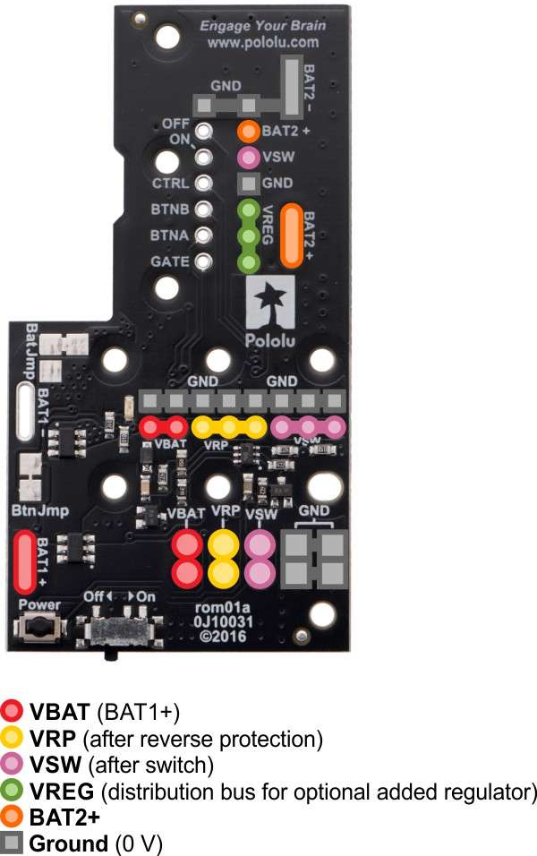

# Mini rover mini swarm

Using the pololu romi platform to create a swarm of few rovers.
Documenting the assembly, setup and usage of some simple, basic and more or less cheap rover platform such as the pololu romi to be controlled by an autopilot (ex ardurover) and evolve in a swarm.

## Rover platform

For all options (pololu romi or alternatives):
- autopilot board compatible with the chosen autopilot (ardupilot or PX4), we chose the mateksys F405-WMO.

### Romi

BOM (can be adjusted)
- romi chassis
- [power distribution](https://www.pololu.com/product/3541) board or the [motor driver + power board](https://www.pololu.com/product/3543) or the [controller board](https://www.pololu.com/product/3544) 
- [encoder pair for romi motors ](https://www.pololu.com/product/3542)
- NiMH batteries
- motor driver (if not using the controller board)

[Assembly guide:](https://www.pololu.com/docs/0J68/all)

Other references:
- https://ardupilot.org/rover/docs/common-autopilots.html
- https://discuss.ardupilot.org/t/ardurover-with-the-pololu-romi/41991

## autopilot

### control modes

The [follow mode](https://ardupilot.org/rover/docs/follow-mode.html) can be used for a basic swarm like behaviour, though it doesn't include any form of self-decision: vehicles follow each other and in order, with one vehicle in front.

### connections

Power distribution board

Wheel encoder.

https://ardupilot.org/rover/docs/wheel-encoder.html

